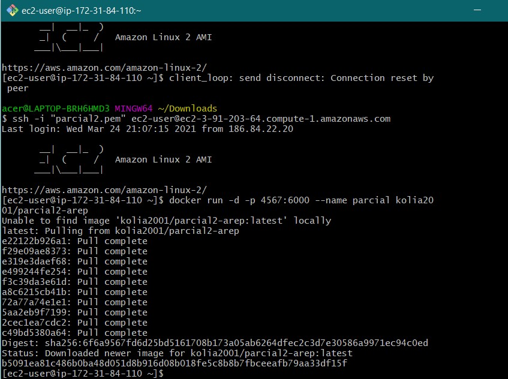
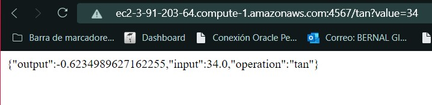
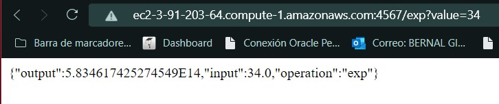

# PARCIAL 2 AREP

Diseñé, construya y despliegue los siguientes servicios en un microcontenedor docker desplegado en una instancei a EC2 de AWS. Cada estudiante debe seleccionar para desarrollar dos funciones matemáticas de acuerdo a los dos últimos dígitos de su cédula como se especifica en la lista. Todas las funciones reciben un solo parámetro de tipo "Double" y retornan una prámetro sde tipo "Double".

## Explicación y Resumen del Proyecto

Se realizará una aplicación, la cual será desplegada en AWS utilizando EC2 y Docker. Se seleccionaran dos funciones matemáticas, en mi caso Tan y Exp, las cuales recibiran un parámetro de tipo Double y retornarán un parámetro de este mismo tipo. Se implementarán los servicios para responder al método de solicitud HTTP GET.

El llamado debe ser de este tipo: `https://amazonxxx.x.xxx.x.xxx:{port}/tan?value=3.141592`.

El formato de salida y respuesta será un JSON con el siguiente formato: 

{

 "operation": "cos",

 "input":  3.141592,

 "output":  -0.999999

}

## Imagenes de consola AWS corriendo

[Video programa en ejecución](https://youtu.be/eLRfh9ZUSsE)

### Consola EC2

### Operacion Tangente

### Operacion EXP

## Empezando e Instalando

Entramos a la carpeta donde queremos guardar nuestro repositorio, en este caso Desktop

`$ cd Desktop`

Clonamos el repositorio en la carpeta

`$ git clone https://github.com/Nikolas2001-13/Parcial2-AREP`

Nos dirigimos a la carpeta que contiene el proyecto

`$ cd Parcial2-AREP`

Compilamos con maven

`$ mvn package`

Correr proyecto

`$ mvn exec:java -Dexec.mainClass="edu.eci.arep.parcial.SparkWebServer"`

Para ejecutar la aplicación

`$ docker-compose up -d `

## Prerrequisitos
Java SE Development Kit 8 -Java SE Runtime Environment 8 -Apache Maven.
Tener conocimiento sobre Maven, GIT, Spark y GITHUB. 
Tener instalado Docker es su máquina.
Conocimientos sobre AWS y EC2.

## Instancia en AWS

[Amazon EC2](https://ec2-3-91-203-64.compute-1.amazonaws.com)

## Correr las Pruebas

Para correr las pruebas del programa habrá que ejecutar el comando

`$ mvn test`

## Documentacion

Para generar la documentación habrá que ejecutar el siguiente comando

`$ mvn javadoc:javadoc`

## Construido Con

* [JUnit](https://mvnrepository.com/artifact/junit/junit) - Test framework
* [Maven](https://maven.apache.org/) - Dependency Management
* [IntelliJ](https://www.jetbrains.com/es-es/idea/) - IDE

## Autor

* **Nikolás Bernal Giraldo** - [Nikolas2001-13](https://github.com/Nikolas2001-13) - Estudiante de la Escuela Colombiana de Ingeniería Julio Gravito

## Licencia

[LICENSE.md](http://www.gnu.org/licenses/gpl.html) 
